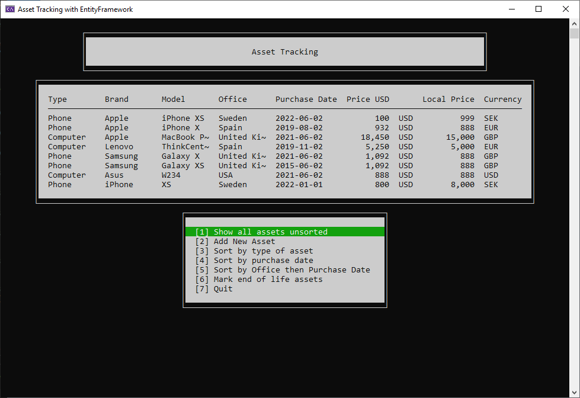
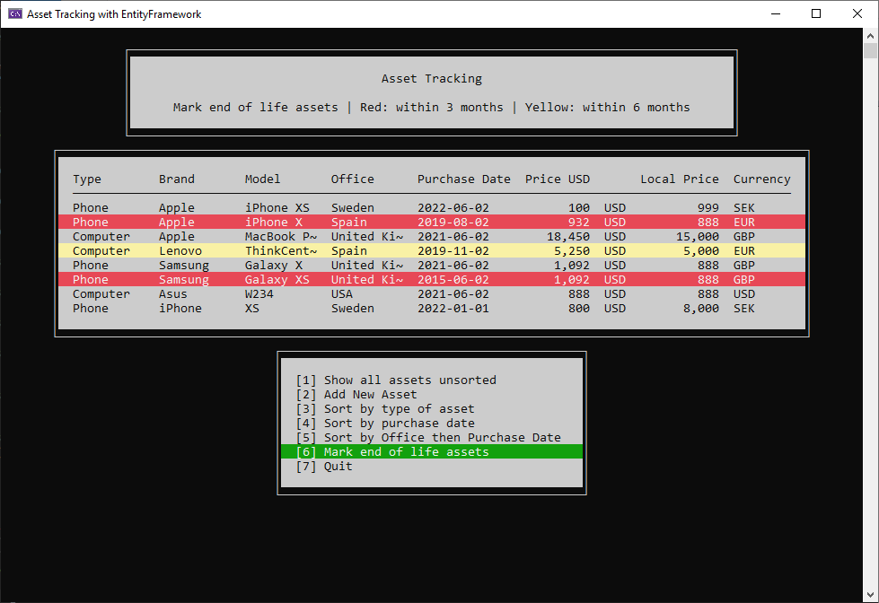

# Asset Tracking with EntityFramework

A console app to manage company assets, utilising an SQL database via EntityFramework and Migrations. A C# course exercise.

This is a modified version of a previous project called [Asset Tracking](https://github.com/tmrk/Asset_Tracking), with the following differences:

* Added EntityFramework to store the data in SQL instead of storing it in a local JSON file
* Added some basic error handling under the AddNew() method
* Minor code improvements
* Changed target to .NET 6

